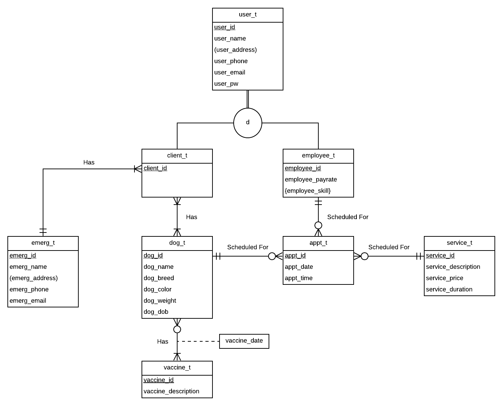
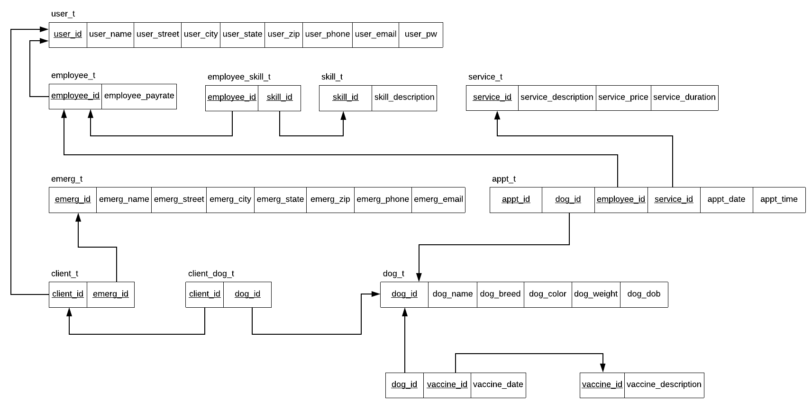

# Dog Daycare Database

Database to manage a dog daycare.

## Background

The dog daycare system is designed to help a dog daycare owner keep track of things like clients, dogs, vaccinations, emergency contacts, employees, and appointments (booked services).

Ideally, the system would have a front end that would allow a user (employee or client) to login in order to view pertinent information.

The dog daycare offers client services such as haircuts, dog sitting (half day and full day), and boarding. These services can be booked for a dog via an appointment. Each appointment must be booked with an associated employee.

Each employee has a payrate and associated skills, such as grooming and dog sitting.

Monitoring a dog’s vaccines is also important. For example, in order to attend daycare, a dog must have a rabies vaccine every year. Additionally, dogs younger than two must have a kennel cough booster every six months.

## Built With

* Oracle SQL
* Oracle SQL Developer

## E-R Diagram

<p>

</p>

As can be seen in the E-R diagram, the user entity is a supertype with subtypes employee and client. The relationship between the supertype and subtypes is total specialization, as indicated by the double line: a user must be either an employee or a client. The disjoint constraint, as indicated by the d, tells us that a user may not be an employee and a client at the same time.

## Relations

<p>

</p>

## Create Tables

These tables have been normalized to 3NF.

```SQL
create table user_t
(user_id varchar2(5),
user_name varchar2(25),
user_street varchar2(30),
user_city varchar2(20),
user_state char(2),
user_zip varchar2(9),
user_phone varchar(10), -- only us phone numbers
user_email varchar(40),
user_pw varchar(20),
constraint user_pk primary key (user_id));

create table employee_t
(employee_id varchar2(5),
employee_payrate number(4,2), -- hourly wage
constraint employee_pk primary key (employee_id),
constraint employee_fk foreign key (employee_id) references user_t(user_id));

create table emerg_t
(emerg_id varchar2(5),
emerg_name varchar2(25),
emerg_street varchar2(30),
emerg_city varchar2(20),
emerg_state char(2),
emerg_zip varchar2(9),
emerg_phone varchar(10), -- assume only us phone numbers
emerg_email varchar(40),
constraint emerg_pk primary key (emerg_id));

create table client_t
(client_id varchar2(5),
emerg_id varchar2(5),
constraint client_pk primary key (client_id),
constraint client_fk1 foreign key (client_id) references user_t(user_id),
constraint client_fk2 foreign key (emerg_id) references emerg_t(emerg_id));

create table dog_t
(dog_id varchar2(5),
dog_name varchar2(25),
dog_breed varchar2(25),
dog_color varchar(25),
dog_weight number(3,1),
dog_dob date,
constraint dog_pk primary key (dog_id));

--dog client JUNCTION table
create table client_dog_t
(client_id varchar2(5),
dog_id varchar2(5),
constraint client_dog_pk primary key (client_id, dog_id),
constraint client_dog_fk1 foreign key (client_id) references client_t(client_id),
constraint client_dog_fk2 foreign key (dog_id) references dog_t(dog_id));

-- skills table
create table skill_t
(skill_id varchar2(2),
skill_description varchar2(25),
constraint skill_pk primary key (skill_id));

-- employee skill JUNCTION table
create table employee_skill_t
(employee_id varchar2(5),
skill_id varchar(2),
constraint employee_skill_pk primary key (employee_id, skill_id),
constraint employee_skill_fk1 foreign key (employee_id) references employee_t(employee_id),
constraint employee_skill_fk2 foreign key (skill_id) references skill_t(skill_id));

create table service_t
(service_id varchar2(2),
service_description varchar2(25),
service_price number(5,2),
service_duration number(4,2), -- hours
constraint service_pk primary key (service_id));

create table appt_t
(appt_id varchar2(5),
appt_date date,
appt_time varchar2(10),
dog_id varchar2(5),
employee_id varchar2(5),
service_id varchar2(2),
constraint appt_pk primary key (appt_id),
constraint appt_fk1 foreign key (dog_id) references dog_t(dog_id),
constraint appt_fk2 foreign key (employee_id) references employee_t(employee_id),
constraint appt_fk3 foreign key (service_id) references service_t(service_id));

create table vaccine_t
(vaccine_id varchar2(2),
vaccine_description varchar2(25),
constraint vaccine_pk primary key (vaccine_id));

create table dog_vaccine_t
(dog_id varchar2(5),
vaccine_id varchar2(2),
vaccine_date date,
constraint dog_vaccine_pk primary key (dog_id, vaccine_id),
constraint dog_vaccine_fk1 foreign key (dog_id) references dog_t(dog_id),
constraint dog_vaccine_fk2 foreign key (vaccine_id) references vaccine_t(vaccine_id));
```

## Insert Data

```SQL
-- insert users
INSERT INTO user_t (user_id,user_name,user_street,user_city,user_state,user_zip,user_phone,user_email,user_pw) VALUES ('00001','Warren Casey','2814 Volutpat Ave','Belmont','MA','02330','0462714005','metuser@aol.com','CWU38WEE0IV');
INSERT INTO user_t (user_id,user_name,user_street,user_city,user_state,user_zip,user_phone,user_email,user_pw) VALUES ('00002','Abraham Henderson','826 Mauris Rd','Plymouth','MA','01563','4060580383','quam.curabitur@bu.edu','NLY08JBR8RN');
INSERT INTO user_t (user_id,user_name,user_street,user_city,user_state,user_zip,user_phone,user_email,user_pw) VALUES ('00003','Tiger Fitzgerald','4820 Suspendisse Ave','Birmingham','AL','11805','6372327046','montes.nascetur@gmail.com','YXK36EGJ6QY');
INSERT INTO user_t (user_id,user_name,user_street,user_city,user_state,user_zip,user_phone,user_email,user_pw) VALUES ('00004','Allistair Orti','7228 Ullamcorper St','Arlington','MA','02486','7318037089','facilisis@gmail.com','UCY35YBC5FN');
INSERT INTO user_t (user_id,user_name,user_street,user_city,user_state,user_zip,user_phone,user_email,user_pw) VALUES ('00005','Basil Bullock','6870 Idaho Ave','Allston','MA','02134','7459110093','quis.pede@yahoo.net','BKT56WHA3NG');
INSERT INTO user_t (user_id,user_name,user_street,user_city,user_state,user_zip,user_phone,user_email,user_pw) VALUES ('00006','Laura Kocubinski','1 Banana Ave','Banana Town','MA','12345','0123456789','eu.tellus.eu@ligula.edu','CRW82LYJ7VA');
INSERT INTO user_t (user_id,user_name,user_street,user_city,user_state,user_zip,user_phone,user_email,user_pw) VALUES ('00007','Talon Austin','9127 Erat Ave','"Patalillo','CA','15789','2104288618','tristique.pharetra@ligula.net','DSB99KAL8AU');
INSERT INTO user_t (user_id,user_name,user_street,user_city,user_state,user_zip,user_phone,user_email,user_pw) VALUES ('00008','Solomon Mccullough','6106 Et Rd','Norfolk','VA','910902','8791767147','scelerisque@sit.ca','GIK99RLY6PH');
INSERT INTO user_t (user_id,user_name,user_street,user_city,user_state,user_zip,user_phone,user_email,user_pw) VALUES ('00009','John French','6618 Accumsan St','Castello','MA','57658','8330841102','nunc.ac.mattis@enim.com','YYV80VPH2AA');
INSERT INTO user_t (user_id,user_name,user_street,user_city,user_state,user_zip,user_phone,user_email,user_pw) VALUES ('00010','Kadeem Miles','816 Quis St','Upplands','MI','07667','2727491646','sagittis.placerat@sed.com','VVR37YPO6QU');
INSERT INTO user_t (user_id,user_name,user_street,user_city,user_state,user_zip,user_phone,user_email,user_pw) VALUES ('00011','Zeus Leblanc','9283 Iaculis Road','Lagos','LA','05840','0202956951','nisl.elementum@unec.com"','PGD70YFL0NS');
INSERT INTO user_t (user_id,user_name,user_street,user_city,user_state,user_zip,user_phone,user_email,user_pw) VALUES ('00012','Honorato Russell','9273 Urna St','Kaiserslauter','RI','90915','8594147810','blandit.consequat@rutr.edu','VXR46DFJ1CS');

-- insert emergency contact
INSERT INTO emerg_t (emerg_id,emerg_name,emerg_street,emerg_city,emerg_state,emerg_zip,emerg_phone,emerg_email) VALUES ('00001','Laura Kocubinski','2 Banana Ave','Banana','MA','12345','0123456789','mauris.blandit@aol.com');
INSERT INTO emerg_t (emerg_id,emerg_name,emerg_street,emerg_city,emerg_state,emerg_zip,emerg_phone,emerg_email) VALUES ('00002','Seth Moses','457 Adipiscing Ave','Auxerre','WI','82049','4194045624','id@risus.net');
INSERT INTO emerg_t (emerg_id,emerg_name,emerg_street,emerg_city,emerg_state,emerg_zip,emerg_phone,emerg_email) VALUES ('00003','Caldwell Mills','2962 Neque St','Hoorn','NB','16796','3130017171','sit@vitae.co.uk');
INSERT INTO emerg_t (emerg_id,emerg_name,emerg_street,emerg_city,emerg_state,emerg_zip,emerg_phone,emerg_email) VALUES ('00004','Maxwell Cotton','810 Enim Ave','Whitby','OR','36908','6652800677','donec.nibh@duiin.net');
INSERT INTO emerg_t (emerg_id,emerg_name,emerg_street,emerg_city,emerg_state,emerg_zip,emerg_phone,emerg_email) VALUES ('00005','John Marsh','712 Amet Ave','Galway','MI','70326','4653160224','nibh.donec@nulla.edu');
INSERT INTO emerg_t (emerg_id,emerg_name,emerg_street,emerg_city,emerg_state,emerg_zip,emerg_phone,emerg_email) VALUES ('00006','Clark Schneider','2287 Nulla Street','Mandurah','WA','44232','1268645605','auctor.nunc@etul.com');
INSERT INTO emerg_t (emerg_id,emerg_name,emerg_street,emerg_city,emerg_state,emerg_zip,emerg_phone,emerg_email) VALUES ('00007','Garrett Hubbard','7276 Est Ave','Vierzon','WY','15789','6311762976','malesuada.ut@saol.com');

-- insert employees
INSERT INTO employee_t (employee_id,employee_payrate) VALUES ('00001',15.00);
INSERT INTO employee_t (employee_id,employee_payrate) VALUES ('00002',20.00);
INSERT INTO employee_t (employee_id,employee_payrate) VALUES ('00003',14.00);
INSERT INTO employee_t (employee_id,employee_payrate) VALUES ('00004',22.50);
INSERT INTO employee_t (employee_id,employee_payrate) VALUES ('00005',18.50);

-- insert clients
INSERT INTO client_t (client_id,emerg_id) VALUES ('00006','00001');
INSERT INTO client_t (client_id,emerg_id) VALUES ('00007','00002');
INSERT INTO client_t (client_id,emerg_id) VALUES ('00008','00003');
INSERT INTO client_t (client_id,emerg_id) VALUES ('00009','00004');
INSERT INTO client_t (client_id,emerg_id) VALUES ('00010','00005');
INSERT INTO client_t (client_id,emerg_id) VALUES ('00011','00006');
INSERT INTO client_t (client_id,emerg_id) VALUES ('00012','00007');

-- insert dogs
INSERT INTO dog_t (dog_id,dog_name,dog_breed,dog_color,dog_weight,dog_dob) VALUES ('00001','Tink','Poodle','Black',13.0,to_date('01-NOV-17','DD-MON-RR'));
INSERT INTO dog_t (dog_id,dog_name,dog_breed,dog_color,dog_weight,dog_dob) VALUES ('00002','Fido','Pug','Tan',15.0,to_date('01-JAN-14','DD-MON-RR'));
INSERT INTO dog_t (dog_id,dog_name,dog_breed,dog_color,dog_weight,dog_dob) VALUES ('00003','Stella','Pitbull','White and Black',45.0,to_date('01-JAN-17','DD-MON-RR'));
INSERT INTO dog_t (dog_id,dog_name,dog_breed,dog_color,dog_weight,dog_dob) VALUES ('00004','Coco','Chihuahua Mix','Brown',40.0,to_date('01-JAN-16','DD-MON-RR'));
INSERT INTO dog_t (dog_id,dog_name,dog_breed,dog_color,dog_weight,dog_dob) VALUES ('00005','Brady','Golden Doodle','Tan',25.0,to_date('01-SEP-18','DD-MON-RR'));
INSERT INTO dog_t (dog_id,dog_name,dog_breed,dog_color,dog_weight,dog_dob) VALUES ('00006','Spot','Beagle','Tan',32.0,to_date('01-JAN-19','DD-MON-RR'));
INSERT INTO dog_t (dog_id,dog_name,dog_breed,dog_color,dog_weight,dog_dob) VALUES ('00007','Bear','Golden Retriever','Tan',45.0,to_date('01-JUN-15','DD-MON-RR'));
INSERT INTO dog_t (dog_id,dog_name,dog_breed,dog_color,dog_weight,dog_dob) VALUES ('00008','Pepper','Terrier','Tan',20.0,to_date('01-JAN-12','DD-MON-RR'));
INSERT INTO dog_t (dog_id,dog_name,dog_breed,dog_color,dog_weight,dog_dob) VALUES ('00009','Oreo','Pomeranian','Black/White',7.0,to_date('01-SEP-13','DD-MON-RR'));

-- insert client dog
INSERT INTO client_dog_t (client_id,dog_id) VALUES ('00006','00001');
INSERT INTO client_dog_t (client_id,dog_id) VALUES ('00006','00002');
INSERT INTO client_dog_t (client_id,dog_id) VALUES ('00007','00003');
INSERT INTO client_dog_t (client_id,dog_id) VALUES ('00008','00004');
INSERT INTO client_dog_t (client_id,dog_id) VALUES ('00010','00005');
INSERT INTO client_dog_t (client_id,dog_id) VALUES ('00011','00006');
INSERT INTO client_dog_t (client_id,dog_id) VALUES ('00012','00007');
INSERT INTO client_dog_t (client_id,dog_id) VALUES ('00012','00008');
INSERT INTO client_dog_t (client_id,dog_id) VALUES ('00012','00009');

-- insert services
INSERT INTO service_t (service_id,service_description,service_price,service_duration) VALUES ('01','Haircut',50.00,1.0);
INSERT INTO service_t (service_id,service_description,service_price,service_duration) VALUES ('02','Half-Day',10.00,4.0);
INSERT INTO service_t (service_id,service_description,service_price,service_duration) VALUES ('03','Full-Day',20.00,8.0);
INSERT INTO service_t (service_id,service_description,service_price,service_duration) VALUES ('04','Boarding',50.00,24.0);
INSERT INTO service_t (service_id,service_description,service_price,service_duration) VALUES ('05','Playgroup',20.00,1.0);

-- insert skills
INSERT INTO skill_t (skill_id,skill_description) VALUES ('01','Grooming');
INSERT INTO skill_t (skill_id,skill_description) VALUES ('02','Dog Walking');
INSERT INTO skill_t (skill_id,skill_description) VALUES ('03','Dog Sitting');

-- insert employee skills
INSERT INTO employee_skill_t (employee_id,skill_id) VALUES ('00001','01');
INSERT INTO employee_skill_t (employee_id,skill_id) VALUES ('00002','03');
INSERT INTO employee_skill_t (employee_id,skill_id) VALUES ('00003','03');
INSERT INTO employee_skill_t (employee_id,skill_id) VALUES ('00004','03');
INSERT INTO employee_skill_t (employee_id,skill_id) VALUES ('00004','02');
INSERT INTO employee_skill_t (employee_id,skill_id) VALUES ('00005','01');
INSERT INTO employee_skill_t (employee_id,skill_id) VALUES ('00005','02');

-- insert appointments
INSERT INTO appt_t (appt_id,appt_date,appt_time,dog_id,employee_id,service_id) VALUES ('00001',to_date('10-AUG-19','DD-MON-RR'),'2:00 PM','00001','00001','01');
INSERT INTO appt_t (appt_id,appt_date,appt_time,dog_id,employee_id,service_id) VALUES ('00002',to_date('15-AUG-19','DD-MON-RR'),'2:00 PM','00002','00004','02');
INSERT INTO appt_t (appt_id,appt_date,appt_time,dog_id,employee_id,service_id) VALUES ('00003',to_date('8-AUG-19','DD-MON-RR'),'8:00 AM','00001','00003','03');
INSERT INTO appt_t (appt_id,appt_date,appt_time,dog_id,employee_id,service_id) VALUES ('00004',to_date('8-AUG-19','DD-MON-RR'),'8:00 AM','00005','00004','04');
INSERT INTO appt_t (appt_id,appt_date,appt_time,dog_id,employee_id,service_id) VALUES ('00005',to_date('8-AUG-19','DD-MON-RR'),'12:00 PM','00003','00003','05');

-- insert vaccines
INSERT INTO vaccine_t (vaccine_id,vaccine_description) VALUES ('01','Rabies');
INSERT INTO vaccine_t (vaccine_id,vaccine_description) VALUES ('02','Bordetella (Kennel Cough)');
INSERT INTO vaccine_t (vaccine_id,vaccine_description) VALUES ('03','Distemper');

-- insert dog vaccine
INSERT INTO dog_vaccine_t (dog_id,vaccine_id,vaccine_date) VALUES ('00001','01',to_date('10-MAR-19','DD-MON-RR'));
INSERT INTO dog_vaccine_t (dog_id,vaccine_id,vaccine_date) VALUES ('00001','02',to_date('10-MAR-19','DD-MON-RR'));
INSERT INTO dog_vaccine_t (dog_id,vaccine_id,vaccine_date) VALUES ('00004','01',to_date('1-JAN-19','DD-MON-RR'));
```

## Sample Queries

Return dogs younger than 2 years old
```SQL
select dog_name, cast((sysdate-dog_dob)/365.25 as decimal(2,1)) as age
from dog_t
where (sysdate-dog_dob)/365.25 < 2
```

Return names of employees who can groom
```SQL
select user_t.user_name, skill_t.skill_description
from (((user_t
inner join employee_t
on user_t.user_id = employee_t.employee_id)
inner join employee_skill_t
on employee_t.employee_id = employee_skill_t.employee_id)
inner join skill_t
on employee_skill_t.skill_id = skill_t.skill_id)
where skill_t.skill_description = 'Grooming'
```

Return dogs and their owners
```SQL
select user_t.user_name, dog_t.dog_name
from (((dog_t
inner join client_dog_t
on dog_t.dog_id = client_dog_t.dog_id)
inner join client_t
on client_dog_t.client_id = client_t.client_id)
inner join user_t
on client_t.client_id = user_t.user_id)
```

Show all appointments
```SQL
select dog_t.dog_name, appt_t.appt_date, appt_t.appt_time, service_t.service_description, user_t.user_name as employee
from ((((dog_t
inner join appt_t
on dog_t.dog_id = appt_t.dog_id)
inner join service_t
on service_t.service_id = appt_t.service_id)
inner join employee_t
on appt_t.employee_id = employee_t.employee_id)
inner join user_t
on employee_t.employee_id = user_t.user_id)
```

Show vaccines for dog 'Tink'
```SQL
select dog_t.dog_name, vaccine_t.vaccine_description, dog_vaccine_t.vaccine_date
from ((dog_t
inner join dog_vaccine_t
on dog_t.dog_id = dog_vaccine_t.dog_id)
inner join vaccine_t
on dog_vaccine_t.vaccine_id = vaccine_t.vaccine_id)
where dog_t.dog_name = 'Tink'
```

## Drop Tables

```SQL
drop table appt_t;
drop table dog_vaccine_t;
drop table vaccine_t;
drop table service_t;
drop table client_dog_t;
drop table client_t;
drop table dog_t;
drop table emerg_t;
drop table employee_skill_t;
drop table skill_t;
drop table employee_t;
drop table user_t;
```

## Author

**Laura Kocubinski** [laurakoco](https://github.com/laurakoco)

## Acknowledgments

* Boston University MET Master Science Computer Science Program
* MET CS 579 Database Management
